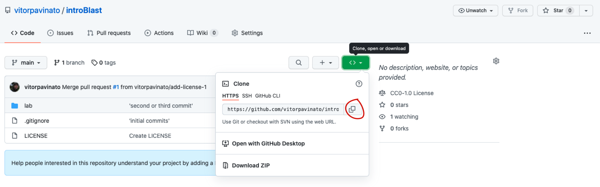

## __Lab 1: Introduction to BLAST (Basic Local Alignment Search Tool)__

## __How to use this material:__

First you need to have a copy of [this](https://github.com/vitorpavinato/introBlast) repository in your computer. The desirable way to do it is using Git (I am using this exercise to introduce Git to those that are not familiar with it).

In the repository page, find the green button with `<>` inside:


A pop-up window will open. In that window, click in the button highlighted in the figure bellow:



Find the terminal program in your OS (in Mac, you need to click on the `Launchpad`, then navigate to the `Other` folder).

Open the terminal, navigate to a folder you choose to have a copy of the repository...for example Documents/.
```dotnetcli
cd Documents/
```
Type:
```dotnetcli
git clone 
```

Paste the repository address after git clone, like this:
```dotnetcli
git clone https://github.com/vitorpavinato/introBlast.git
```

Then navigate inside the repository folder:
```dotnetcli
cd introBlast
```

The folder contains the following subfolders:
```dotnetcli
.
├── docs
│   └── Altschul_etal_1990.pdf
├── lab
│   ├── README.md
│   ├── data/
├── lecture
```
In lab you find this README.md file with all instructions we are going to follow in this class. Lecture will have the material for the class on January, 27th 2022. 

lab/data contains the files with the sequences were are going use to find similarities with sequences available in the NCBI database.

## __Installation of the standalone BLAST__ 

The next thing to do is to install a command line interface of BLAST (Blast-CLI).

__For Windows:__
A good explanation on how to download and install BLAST+ on Windows OS can be found [here](https://www.ncbi.nlm.nih.gov/books/NBK52637/).

Mac and Linux users should first check if BLAST was already installed:
```dotnetcli
which blastn
```
Run this code to check in any blast implementation (in this case _blastn_ is installed).

If you see something like this:
```dotnetcli
/usr/bin/blastn
```
OR
```dotnetcli
/usr/local/bin/blastn
```
 You can skip the next step.

__For Mac:__

First install Homebrew in your machine. Homebrew emulates the capabilities of a software package management found in Linux machines.
```dotnetcli
/bin/bash -c "$(curl -fsSL https://raw.githubusercontent.com/Homebrew/install/master/install.sh)"
```
Then you install BLAST by running:
```dotnetcli
brew install blast
```
__For Linux:__
```dotnetcli
sudo apt-get install ncbi-blast+
```

## __Sequence similarity search with Web-based BLAST__

We are going to start this tutorial by using the web-based version of BLAST to find similar sequences. Similarity search is the first step on homology and functional prediction. In this tutorial we are not focus on the details behind the BLAST implementation (algorithm and theory). Instead, we are going to focus on how interpret the search output. From there, we can try to develop some intuition that will help us understand the technicalities behind the algorithm and implementation.

Some important keywords to remember:
- Query refers to the sequence your interested in to search (usually the gene or collection of genes you are working with);
- Subject refers to the database you are going to search for similarities (nr/nt, RefSeq etc);
- nr/nt refers to the not curated nucleotide collection;
- RefSeq refer to the collection of reference sequences (many flavors);

    