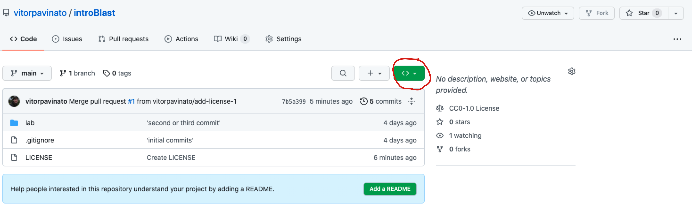

# __Lab 1: Web-based and standalone BLAST__

## __Before we start__

Make sure you tick all items in the __TO DO__ list below before the class on January $14^{th}$.

- [ ] If you don't have git, install it following the instructions below (only for Windows users, Unix users it is already installed);
- [ ] Install the standalone BLAST (see instructions below);
- [ ] Make a copy of this repository using git (see instructions below);
- [ ] Make sure you have a copy on your machine of the sequences stored in `lab/data/`;
- [ ] Skim read this page to have an idea of what is going to be asked in the class;
- [ ] Read until the __Background__ section and do the activities asked, especially:
    - [ ] Watch the two short introduction videos;
    - [ ] Try to answer all the questions; 
    - [ ] Bring your questions to the class, so we can discuss them before the activities.
- [ ] (Optional) read "BLAST: a critical guide" (provided in the `docs/` folder).

## __How to install Git__

__For Windows__
Please follow the instructions found [here](https://git-scm.com/download/win) for the __Standalone Installer__. Make sure git is in your PATH (which means you can access it by typing git in your terminal). [This](https://medium.com/devops-with-valentine/2021-how-to-install-git-on-windows-10-step-by-step-guide-1c9db500e734) tutorial might help you install git on Windows and make it "visible" to the terminal app (you can skip step 2 in the git installation guide).

__Mac and Linux:__
Mac and Linux OS's have it natively install. Just to make sure you have it, type:
```dotnetcli
which git
```
You should have something like this if git is already installed in your computer:
```dotnetcli
/usr/bin/git
```

__For Linux:__
If you, for some reason, don't have it installed, or if you want to have a recent version of git, you can install it on Ubuntu (Linux) by typing:
```dotnetcli
sudo apt-get install git
```
__For Mac:__
If your macOS doesn't have git, you can install via Homebrew (see instructions below on how to install Homebrew in Mac). After you have Homebrew installed, open another terminal window and type:
```dotnetcli
brew install git
```

## __How to install the standalone BLAST__ 

The next thing to do is to install a command-line interface of BLAST (Blast-CLI).

__For Windows:__
A good explanation on how to download and install BLAST+ on Windows OS can be found [here](https://www.ncbi.nlm.nih.gov/books/NBK52637/). Make sure to have blast visible in the command line. You can check by typing:
```dotnetcli
blastn --help
```
If the terminal throws an error, you can see if the command below works:
```dotnetcli
C:\Program Files\NCBI\blast-2.12.0+\bin\blastn --help
```
If it works, every time you see blastn (or blastp), you can replace the command provided below with `C:\Program Files\NCBI\blast-2.12.0+\bin\blastn` before you run it in the command line.

__Mac and Linux:__

Mac and Linux users should first check if BLAST is already installed:
```dotnetcli
which blastn
```
Run this code to check in any blast implementation (in this case _blastn_ is installed).

If you see something like this:
```dotnetcli
/usr/bin/blastn
```
OR
```dotnetcli
/usr/local/bin/blastn
```
 You can skip the next step.

__For Mac:__

First, install Homebrew in your machine. Homebrew emulates the capabilities of a software package management found in Linux machines:
```dotnetcli
/bin/bash -c "$(curl -fsSL https://raw.githubusercontent.com/Homebrew/install/master/install.sh)"
```
Then, you should install BLAST by running:
```dotnetcli
brew install blast
```
__For Linux:__
```dotnetcli
sudo apt-get install ncbi-blast+
```

## __How to make a local copy of this repository:__

First, you need to have a copy of [this](https://github.com/vitorpavinato/introBlast) repository on your computer. The desirable way to do it, is by using Git (I am using this exercise to introduce Git to those that are not familiar with it).

In the repository page, find the green button with `<>` inside:



A pop-up window will open. In that window, click on the button highlighted in the figure below:


Find the terminal program in your OS (in Mac, you need to click on the __Launchpad__, then navigate to the __Other__ folder).

Open the terminal, navigate to a folder you choose to have a copy of the repository...for example Documents/.
```dotnetcli
cd Documents/
```
Type:
```dotnetcli
git clone 
```

Paste the repository address after git clone, like this:
```dotnetcli
git clone https://github.com/vitorpavinato/introBlast.git
```

Then navigate inside the repository folder:
```dotnetcli
cd introBlast
```

The folder contains the following subfolders:
```dotnetcli
.
├── docs
│   └── Altschul_etal_1990.pdf
├── lab
│   ├── README.md
│   ├── data/
├── lecture
```
In *lab* you find this README.md file with all instructions we are going to follow in this class. The lecture will have the material for the class on January, 27th 2022. 

`lab/data` contains the files with the sequences we are going to use to find similarities with sequences available in the NCBI database.

# __Introduction to BLAST__

For this part of the lab, we are going to follow an activity that is part of _Genome Solve_ material that can be found [here](https://qubeshub.org/publications/1085/2). This material was first developed by Anne Rosenwald, Gaurav Arora, Vinayak Mathur (Rosenwald, Arora & Mathur 2020) and later adapted (September 2021) by Sarah Prescott [here](https://qubeshub.org/publications/2754/versions/1).

Rosenwald A, Arora G, Mathur V (2020) Pre-lesson: Introduction to BLAST. 
doi:/10.25334/TY8V-G541

## __Learning Outcomes:__
We are going to start this tutorial by using the web-based version of BLAST to find similar sequences. Similarity search is the first step in homology and functional prediction. In this tutorial, we are not focusing on the details behind the BLAST implementation (algorithm and theory). Instead, we are going to focus on how to interpret the search output. From there, we can try to develop some intuition that will help us understand the technicalities behind the algorithm and implementation.

When you have completed this activity, you should be able to:
- Use BLAST for homology search
- Utilize the BLAST tool to find nucleotide or protein sequences similar to your query
- Interpret BLAST search results, including what makes a significant hit
- Understand how genomic sequence information can be used to find patterns and infer possible function
- Download and upload sequence data in FASTA format
- Find accession and GI numbers that reference a particular sequence

## __Background:__
The purpose of this exercise is to get familiar with the Basic Local Alignment Search Tool (BLAST). BLAST is the "google search -like tool in bioinformatics". BLAST is primarily used to find regions of local similarity between sequences. Highly similar sequences might mean they share a common ancestor. In this way, they are homologous. Homologous sequence shares similar functions, so you can predict the function by looking for sequence homology. BLAST compares a query sequence (a protein or nucleotide sequence) against a sequence database and calculates the significance of matches. BLAST divides the query sequence into shorter words and initially looks for matches of these words only. The tool gives a score based on a scoring system e.g. in blastn, it will give +1 for each match and -2 for each mismatch (an example of a simple scoring matrix).

Some important keywords to remember:
- Query refers to the sequence you are interested in searching for (usually the gene or collection of genes you are working with);
- Subject refers to the database you are going to search for similarities (nr/nt, RefSeq etc);
- nr/nt refers to the not curated nucleotide collection;
- RefSeq refers to the collection of reference sequences (many flavors);

_Task_ - Before beginning the tasks of the activity, please review the two videos below to review the BLAST tool. 

Watch [this](https://youtu.be/JKD5laNtwSc) overview of BLAST video ONLY to the 6:33 mark. End before the speaker begins on the Detailed Tasks page.(you can watch the entire video if you want; the presenter shows several applications).

To further your understanding of BLAST returns, watch [this](https://youtu.be/dzRq-5BrGD4) short video on E-values by NCBI and answer the questions that follow.

- Why align sequences?
- Which alignments are significant?
- What is local alignment?
- What does BLAST tell you?
- If two sequences are similar, they are always homologous?
- What is the expected value (e-value)?
- How are scores and e-values related?
- Can e-values be directly compared when searching databases of different sizes? Why or why not? What about the bit scores with the same question? What if you change the scoring matrix? (we are going to have an example below);
- Is there a magic cutoff for poor e-values?
- How might you determine an e-value cutoff? 
- What is meant by a reported e-value of 0.0? 

## __Part A: Using BLAST to search for closely related organisms__

This exercise demonstrates the different kinds of results you get when you search sequence databases with different algorithms using either a DNA or protein sequence from the same gene.

_Task_ - Retrieve the GenBank sequence for NM_001026785.1, as follows:

1. Go to the [NCBI](https://www.ncbi.nlm.nih.gov) web page

2. Enter the ID into the search box, and select “Nucleotide” in the pull-down menu next to the word search box on the left, and then click “Search”. On the preceding page click on the ID to get to the GenBank page.

3. Retrieve the FASTA formatted sequence for NM_001026785.1:
    - Click on the “FASTA” link on the top left of the page; 
    - Paste the sequence below in new text file;
    - Adjust the format using the following rules for FASTA formatted sequence:
     
    The first line is called the “header” and always starts with `>`. The sequence identifier must immediately follow the `>`. (No space allowed between the `>` and the identifier). The header may include additional information after the identifier, separated from the identifier by a space. The header must all be on a single line. The sequence starts on the second line and can continue on additional lines The length of the sequence on each line doesn’t matter. Spaces and non-sequence characters are not allowed within the sequence. FASTA formatted sequences use single line spacing.

4. Save as `celegans_sod.fasta` in the `data/` folder (a file containing this sequence can be found at `lab/data`).

_Task_ - Run a BLASTN search using the NR (Non-redundant database) using the sequence associated with NM_001026785.1 as follows:

5. Go to the BLAST homepage and select Nucleotide Blast.

6. Enter the query sequence: Paste the FASTA formatted sequence you formatted above into the search box. Be sure that the FASTA formatting rules are maintained. In some cases, the header line will wrap around the second line. In that case, delete the second header line, so that the sequence starts on the second line.

7. Select the database and blast program: The default should be Standard Databases and __“Nucleotide collection (nr/nt)”__ in the Database pull-down menu. Under __“Program Selection”__, select __“megablast”__. Parameters can be selected by looking under __“Algorithm Parameters”__. Set the __“Max Target Sequences”__ to 500 under __“Algorithm Parameters”__.

8. Click BLAST and wait for the results, look at the results and paste a screenshot below.

9. Interpreting taxonomy report
    
    - Click on the __“Taxonomy report”__ link in your BLAST header report. List the taxonomic groups below that have homologs. Remember to check that the E-value is significant before considering a “hit” to be a homolog.
    - Repeat the search, except under “Program Selection”, select “blastn” (you chose (megablast) on the prior search)
    - List below the major taxonomic groups with homologs (be sure that the E-value is significant).
    - Were there any homologs in any plant species? Support your answer with E-values?
    - How and why are the results different from the first blast (megablast)?

## __Part B: Picking the best match for your query sequence__

This set of questions demonstrates the different matches you get when you run a BLAST search and how to pick the best matches for your search.

The FASTA sequence for this part of your problem set is given in the file `data/seq_partb.fasta`.

1. Go to BLAST and select nucleotide blast and paste the FASTA sequence `data/seq_partb.fasta` in the “Query Sequence Box”. Choose “Standard databases/nucleotide collection” for database, under “Choose search set”. Since the rest of the search sets are optional, you need not check them for this exercise, but their functionality is explained below: 

_Organism (optional):_ You could enter the name of the organism, however, the program identifies the organism on its own. 

_Exclude (optional):_ This option allows you to exclude identifiers with XM (predicted mRNA models) and XP (predicted protein models) as well as other samples from your query. Sequences associated with these identifiers are usually associated with incomplete data or data that come from sequencing only without associated biological information. Excluding these identifiers will make the query search quicker. 

_Entrez query (optional):_ This option allows you to restrict your search to a subset of entries.

_Task_ - Run a blastn and wait for the results on the preceding page and answer the following questions:

2. What is the primary citation for the BLAST program?  Hint: Look in the BLAST header report.

3. How many sequences are there in the database that was used for your search? Hint: All this information is there in the header report under Databases.

4. What does the color code on the graphical interface represent?.

5. What are the bit score, E-value, and query coverage values of the first ten hits of the BLAST results?

6. Which scoring matrix was used?

6. There are some entries with significant E-values (low E-values). Are these all best matches to the entire query sequence? How would you pick the best match between the query and subject? For this, it would help you to give an example of the best match and one that may not be a good match, despite a low E-value. Justify your answers.

7. How would you identify a closely related species to your query sequence?

## __Part C: Using BLASTP to identify repeats__

The next set of questions demonstrates how repeating characters in a sequence (such as repeating patterns of amino acids) can affect the results of a database search.

_Task_ - Retrieve the FASTA formatted sequence for the protein CAC40682.1 from NCBI and paste it below. 

1. What organism is this sequence from? How long is the sequence?

2. Does anything stand out about this sequence when you look at it?

3. Run a BLASTP search of CAC40682.1 using the “Reference Proteins” database and set organism to _Drosophila melanogaster_. Can you identify the conserved domains? 

4. What database is associated with the annotations? Hint: Look at the conserved domains graphic and click on it to identify the database from where the annotation is imported. Loot [here](https://www.ncbi.nlm.nih.gov/refseq/about/nonredundantproteins/) for some hints.

5. What is the best hit (the first match listed) and what is the E-value?

6. Look at the alignment (scroll down). Which amino acid is aligned most frequently? (You can answer this by just looking at the alignment).

7. Using the same query sequence for BLASTP, set the database to “Reference Proteins” and the organism to “Drosophila melanogaster”. This time, turn on “Filter Low Complexity Regions” under “Algorithm Parameters”. Did you find a homolog in _Drosophila melanogaster_?

8. Based on results from the previous question (1-5)s, do you think this protein has a homolog in _Drosophila melanogaster_? Explain why or why not. 

# __Introduction to standalone BLAST__

## __Web-based BLAST search:__

Before we start, we are going to run the web-based BLAST first to compare with the results we are going to obtain with the standalone BLAST.

1. Use your favorite browser to navigate to NCBI’s BLAST web page at https://blast.ncbi.nlm.nih.gov/Blast.cgi.  Find our example sequence data from the directory I sent you.  The first search we’ll try is a basic BLAST of our example DNA sequence.  Choose the nucleotide BLAST option, and copy the sequence from the cDNA_test_seq.fa file.  

    We’re not changing any parameters this time, but notice that we’re searching against the entire nucleotide collection (the ‘search set’), and using megablast to search for highly similar sequences.  Expand the “Algorithm parameters” section to see what else we could change if necessary.  Check the box to show results in a new window (so we can compare) and BLAST your sequence.  How many hits do you get?  Based on your results what do you think our sequence is?  What are the other sequences that have matched with ours?

    Try changing the search program from ‘highly similar’ to ‘somewhat similar sequences’.  What does this do?  Do we see the same results?  What exactly does this change about the algorithm?

2. Go back to the original BLAST page and choose the protein BLAST option.  Copy our amino acid sequence (which is a translation of the cDNA sequence we’re using) and BLAST using the default parameters.  How do these results compare with your nucleotide BLAST results?

    Run this search again, but this time change the scoring matrix from BLOSUM62 to BLOSUM90 (similar to changing the search program the nucleotide BLAST from highly to somewhat similar).  How does this change your results?

## __CLI BLAST:__

1. Open your command line terminal and navigate to the repository folder containing the data for this lab: `introBlast/lab/data`. 

2. The first thing we need to do is make a BLAST database from our sample genome so that its search algorithms can efficiently parse each sequence. We will use the command makeblastdb. But before we do it, we need to download the genome we are going to use as a subject (database).
     - Go to [this](http://ftp.ensemblgenomes.org/pub/metazoa/release-52/fasta/aedes_aegypti_lvpagwg/dna/) page;
     - Click on Aedes_aegypti_lvpagwg.AaegL5.dna_sm.toplevel.fa.gz to start downloading the file;
     - Then move this file to `introBlast/lab/data` folder (you can move using your terminal by typing `mv path/to/the/file path/to/introBlastlab/data`);
     - decompress the file.

    Use the –h flag to look at the different options for this command.  To make BLAST retain the headers for our contigs we’ll use the –parse_seqids option, and we’ll tell BLAST that this is nucleotide sequence data using the –dbtype option. 

We’ll run this using the command. 
```dotnetcli
makeblastdb -in Aedes_aegypti_lvpagwg.AaegL5.dna_sm.toplevel.fa -parse_seqids -dbtype nucl
```

List the contents of your directory (by typing `ls`).  What new files have appeared?

3. The first comparison we’ll make here is to search for our cDNA sequence using the defaults, which will run a high similarity search.  Take a look at the defaults for each parameter using -help.

Run this comparison using the following command:
```dotnetcli
blastn -query cDNA_test_seq.fa -db Aedes_aegypti_lvpagwg.AaegL5.dna_sm.toplevel.fa -out highly_similar_cDNA
```
Take a look at the output file that’s appeared in your directory (using a text editor like TextWrangler or Notepad or TextEdit, or using the terminal by typing `less <<output>>`). How many highly similar sequences are there in the _A. aegypti_ genome? How many different scaffolds does that cover?  What is a likely explanation for multiple hits here?

4. Next we’ll run our search again using less stringent parameters that will equate to the ‘somewhat similar’ search option in the BLAST web interface.  For this search, we’re going to increase the word size to 11, change the reward to 2 and the penalty to -3, change the open gap penalty to 5, and the gap extension penalty to 2.  Use the -h option to help you determine which options equate to these, and run your search again (remember to include an out file with a name that’s different from the one you saved the highly similar results to!).
```dotnetcli
blastn -query cDNA_test_seq.fa -db Aedes_aegypti_lvpagwg.AaegL5.dna_sm.toplevel.fa -word_size 11 -reward 2 -penalty -3 -gapopen 5 -gapextend 2 -out somewhat_similar_cDNA
```
Are there more or fewer results? Having run both, which search makes more sense in this situation?

5. Finally, we’ll use the results from our searches to look at the evolution of our query and the subject hits.  To simplify, we’ll include the top hits with alignments longer than 600 base pairs from our highly similar search.

    Rerun the highly similar blast search you performed earlier, but this time change the output format to include the subject id, subject start, subject end, alignment length, and subject sequence in a tabular file (example: -outfmt ‘6 option option option…’).  Also, limit the number of hits per contig to 1 using the -max_hsps option.  I’ve included the output formatting options table below to help you:

| outfmt | string | 0 | alignment view options |
|--------|--------|---|------------------------|
|        |        |   |0 = pairwise         |   
|        |        |   |1 = query-anchored showing identities|
|        |        |   |2 = query-anchored no identities,|
|        |        |   |3 = flat query-anchored, show identities,|
|        |        |   |4 = flat query-anchored, no identities,|
|        |        |   |5 = XML Blast output,|
|        |        |   |6 = tabular,|
|        |        |   |7 = tabular with comment lines,|
|        |        |   |8 = Text ASN.1,|
|        |        |   |9 = Binary ASN.1|
|        |        |   |10 = Comma-separated values|
|        |        |   |11 = BLAST archive format (ASN.1)|
|        |        |   |Options 6, 7, and 10 can be additionally configured to produce a custom format specified by space delimited format specifiers.|

The supported format specifiers are:
- qseqid means Query Seq-id
- qgi means Query GI
- qacc means Query accession
- sseqid means Subject Seq-id
- sallseqid means All subject Seq-id(s), separated by a ';'
- sgi means Subject GI
- sallgi means All subject GIs
- sacc means Subject accession
- sallacc means All subject accessions
- qstart means Start of alignment in query
- qend means End of alignment in query
- sstart means Start of alignment in subject
- send means End of alignment in subject
- qseq means Aligned part of query sequence
- sseq means Aligned part of subject sequence
- evalue means Expect value
- bitscore means Bit score
- score means Raw score
- length means Alignment length
- pident means Percentage of identical matches
- nident means Number of identical matches
- mismatch means Number of mismatches
- positive means Number of positive-scoring matches
- gapopen means Number of gap openings
- gaps means Total number of gap
- ppos means Percentage of positive-scoring matches
- frames means Query and subject frames separated by a '/'
- qframe means Query frame
- sframe means Subject frame
- btop means Blast traceback operations (BTOP)
- staxids means unique Subject Taxonomy ID(s), separated by a ';'(in numerical order)
- sscinames means unique Subject Scientific Name(s), separated by a ';'
- scomnames means unique Subject Common Name(s), separated by a ';'
- sblastnames means unique Subject Blast Name(s), separated by a ';' (in alphabetical order)
- sskingdoms means unique Subject Super Kingdom(s), separated by a ';' (in alphabetical order)
- stitle means Subject Title
- salltitles means All Subject Title(s), separated by a '<>'
- sstrand means Subject Strand
- qcovs means Query Coverage Per Subject (for all HSPs)
- qcovhsp means Query Coverage Per HSP
- qcovus is a measure of Query Coverage that counts a position in a subject sequence for this measure only once. The second time the position is aligned to the query is not counted towards this measure.
- When not provided, the default value is:
- 'qseqid sseqid pident length mismatch gapopen qstart qend sstart send evalue bitscore', which is equivalent to the keyword 'std'

The solutions for the above question is:
```dotnetcli
blastn -query cDNA_test_seq.fa -db Aedes_aegypti_lvpagwg.AaegL5.dna_sm.toplevel.fa -outfmt '6 sseqid sstart send length  sseq' -max_hsps 1 -out highly_similar_cDNA_2
```

6. Next we’re going to manually manipulate our results to provide the sequences to an aligner (Note: normally this would all be done via command line for efficiency, so if you do this in real life I highly recommend picking up the basics of file manipulation to make your life much, much easier). Open up your results file and delete any hit shorter than 600 base pairs.  Reformat to fasta format.  Finally, open up your query sequence and copy that to your reformatted results file as well. Save this as a new file with the ‘.fa’ extension.
    
    Open up the web-based alignment program Clustal Omega at https://www.ebi.ac.uk/Tools/msa/clustalo/ and enter your input sequences from the file you just created.  Remember to change the sequence type option from protein to DNA. Any of the output options are fine, as we’re just using their online services. Submit your job.

    After your alignment is finished you could export it for further analysis, but for now, we’ll take a look at the tree produced using a neighbor-joining algorithm (“Phylogeny” tab at the top). What can you infer from this tree about the copies of our genes?

7. Celebrate- you’re a BLAST master!


---